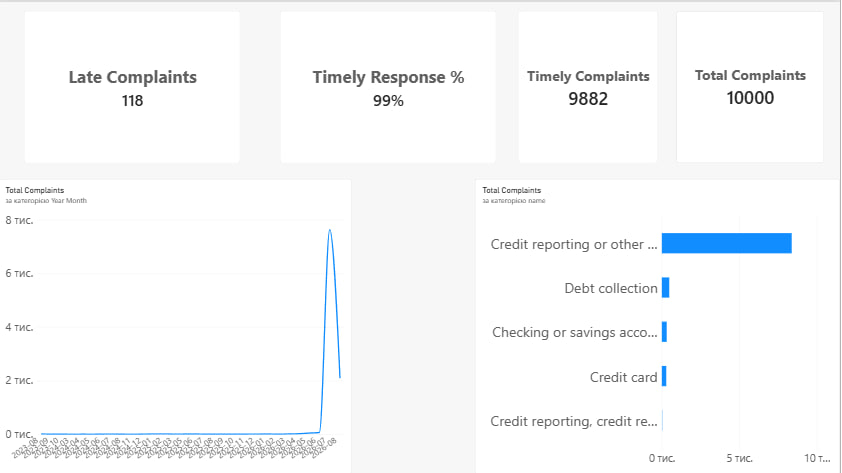

# Consumer Financial Complaints Analytics

Beginner data analytics project that transforms consumer complaint data in SQLite and presents the results in an interactive Power BI dashboard.

## Dashboard



The dashboard summarizes a sample of **10,000 complaints** and includes:

- total complaints;
- timely and late company responses;
- timely response percentage;
- complaint trends over time;
- complaints by financial product.

## Key results

| Metric | Result |
|---|---:|
| Total complaints | 10,000 |
| Timely complaints | 9,882 |
| Late complaints | 118 |
| Timely response rate | 98.82% |

## Technologies

- SQLite
- SQL
- Power BI Desktop
- Power Query
- DAX
- Git and GitHub

## Data model

The Power BI report uses a star schema. `FactComplaints` is the central fact table and is connected to dimension tables containing companies, products, issues, locations, submission channels, response types, and dates.
(diagrams/complaints-relationship-diagram)

## Project structure

```text
consumer-financial-complaints/
├── dashboard/
│   ├── consumer_complaints.pbix
│   └── dashboard_preview.png
├── database/
│   └── complaints.db
├── diagrams/
│   └── database_diagram.png
├── DESIGN.md
├── queries.sql
├── .gitignore
└── README.md
```

## Main DAX measures

```DAX
Total Complaints =
DISTINCTCOUNT(FactComplaints[id])
```

```DAX
Timely Complaints =
CALCULATE(
    [Total Complaints],
    FactComplaints[timely_response] = 1
)
```

```DAX
Late Complaints =
CALCULATE(
    [Total Complaints],
    FactComplaints[timely_response] = 0
)
```

```DAX
Timely Response % =
DIVIDE(
    [Timely Complaints],
    [Total Complaints],
    0
)
```

## How to open the project

1. Clone or download this repository.
2. Open `dashboard/consumer_complaints.pbix` in Power BI Desktop.
3. If Power BI cannot refresh the data, configure a 64-bit SQLite ODBC data source that points to `database/complaints.db`.
4. Open `queries.sql` to review the database creation and transformation queries.

## Data source

The project is based on the public [Consumer Complaint Database](https://www.consumerfinance.gov/data-research/consumer-complaints/) published by the Consumer Financial Protection Bureau.

## Purpose

The goal of this project is to demonstrate a complete beginner analytics workflow: importing raw data, designing a relational database, transforming data with SQL, building a Power BI data model, creating DAX measures, and presenting the results in a simple dashboard.
